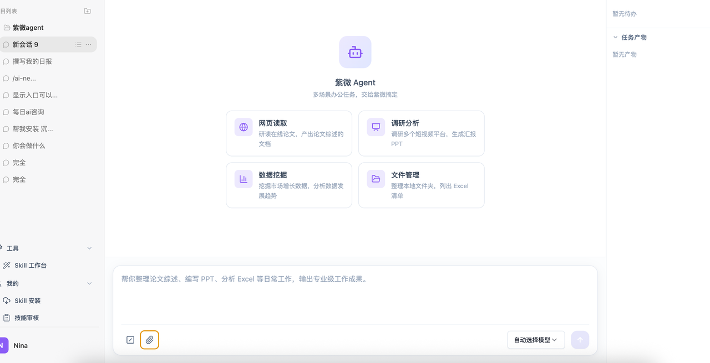
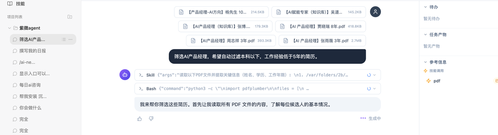

# 行业应用案例：高效人才简历筛选

> **场景描述**：HR 或部门主管需要从大量简历附件中快速定位最匹配的候选人。

下面用一个完整的工作流，展示如何用 Polaris Core 在几分钟内完成一轮高质量的简历筛选。

## 步骤 1：批量上传简历

将多份简历（PDF / Word）批量拖入对话框。Polaris Core 会自动解析每一份简历的文本与结构化字段。

## 步骤 2：设定筛选标准

输入精准指令，例如：

> **筛选 AI 产品经理，希望自动过滤本科以下、工作经验低于 5 年的简历。**

Agent 会根据条件做第一轮过滤，并把符合条件的候选人列表返回给你。

## 步骤 3：多轮追加筛选

基于初筛结果，你可以继续追加需求，不用从头来一遍：

> **在这几个人中，根据项目经验丰富程度进行打分（1–10 分），并以表格形式输出。**

Agent 会基于上下文继续推理，输出可直接复制到表格软件的结果。

## 步骤 4：一键总结

要求 Agent 生成一份候选人评估摘要：

> **请输出每位候选人的优势、风险点和面试关注问题，做成一页纸的评估摘要。**

输出可以直接用作面试参考。

---

## 这个案例展示了什么

* **多文件理解**：一次性吃掉几十份简历，无需手动复制粘贴。
* **多轮上下文**：可以在同一个会话里不断追加规则，而不是每次都重新提问。
* **结构化输出**：表格、评分、摘要等都能按你想要的格式直接交付。

> 想把这套流程沉淀下来反复使用？把它做成一个 **简历筛选 Skill** 即可，参考 [核心功能操作指南](../guide/core-features.md#2-使用-skill-技能)。
