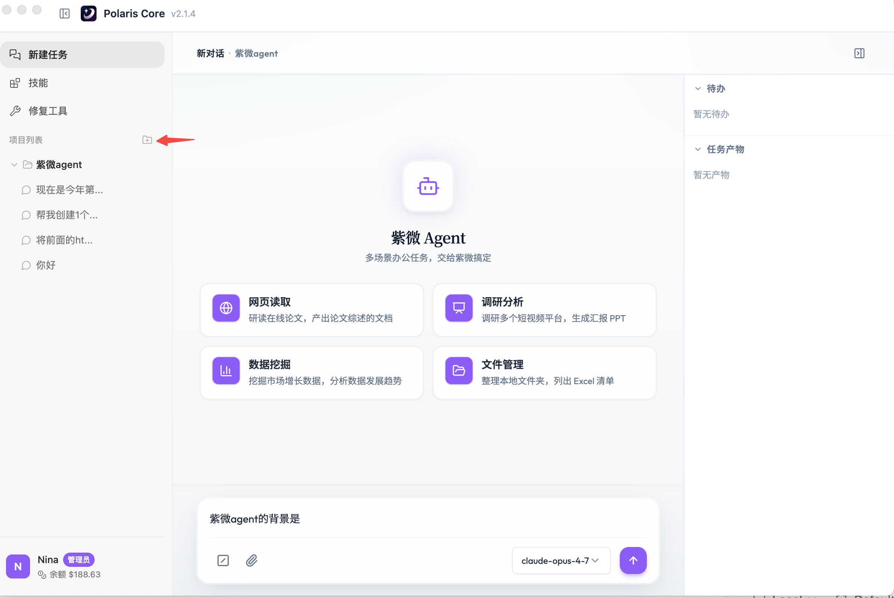
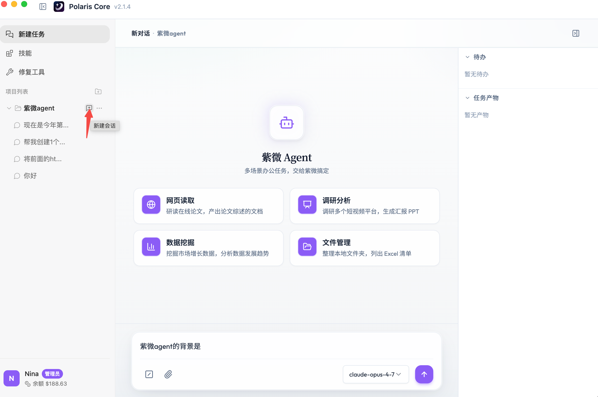
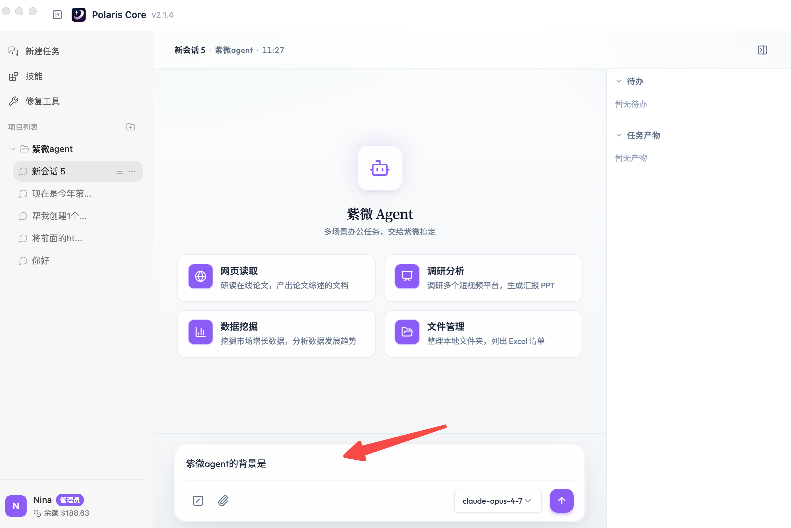
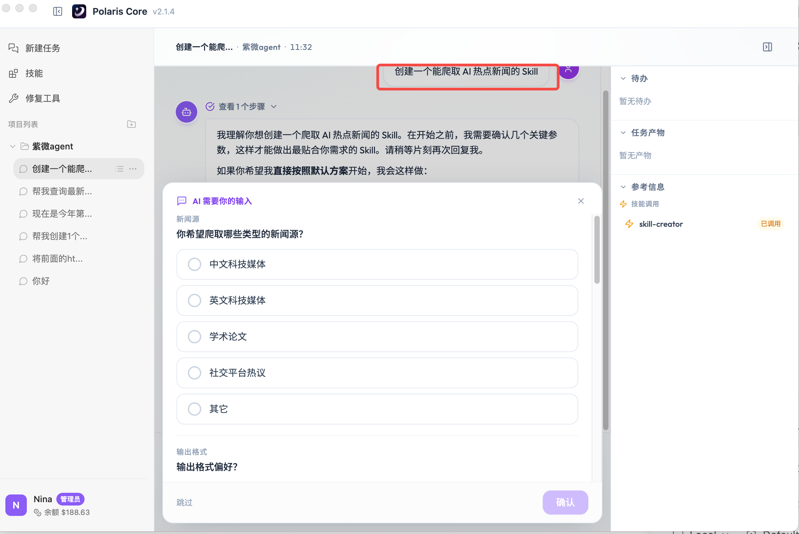
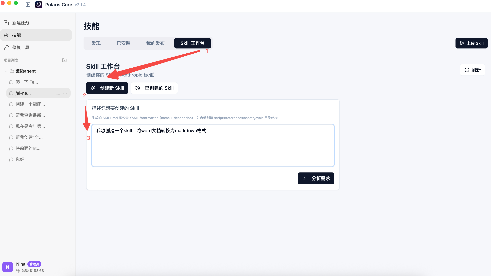
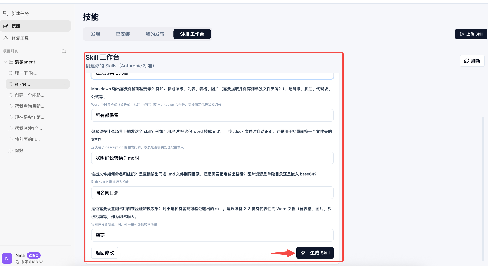
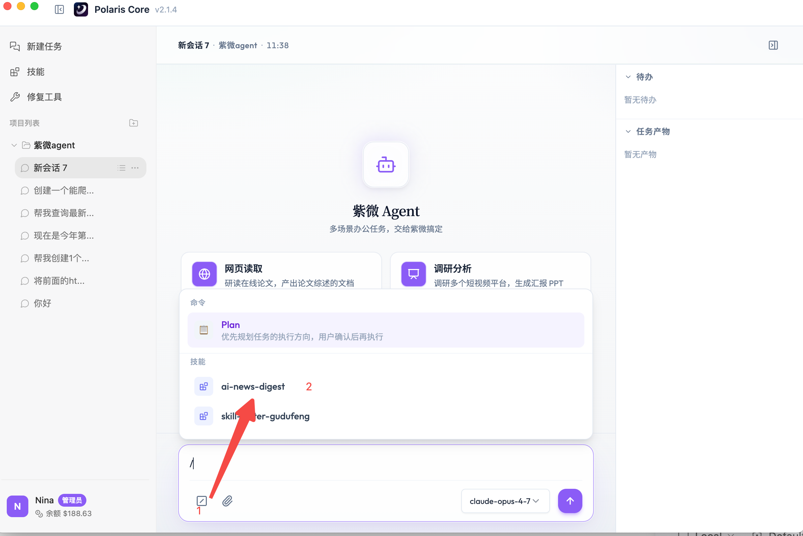
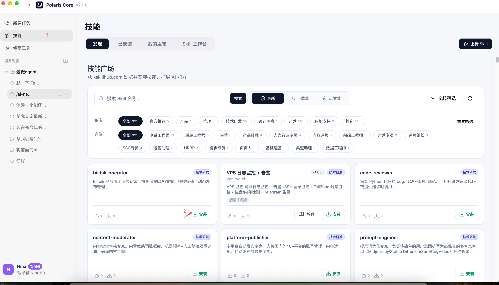
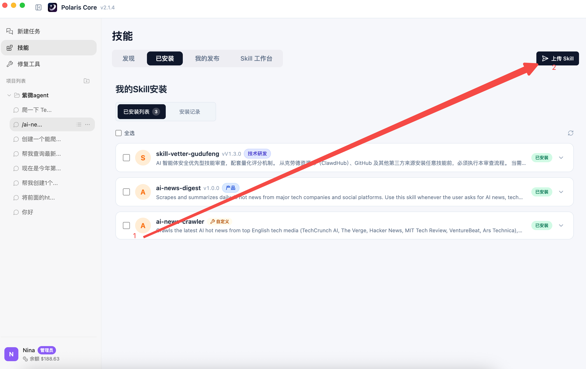

# 二、核心功能操作指南

本章带你快速上手 Polaris Core 的两个核心能力：**对话任务** 和 **Skill（技能）**。

## 1. 开启对话任务

### 1.1 创建项目

点击项目列表右上角的 **「+」**，根据你的工作分类（例如：市场分析、技术方案）创建不同的项目文件夹，保持工作区整洁。

### 1.2 发起会话

进入对应的项目文件夹，点击右上角的 **「新建会话」** 按钮。

### 1.3 发送请求

在底部输入框输入你的指令。你可以直接发送：

* 文件
* Excel 表格
* 网页链接

Agent 会自动为你解析。

### 1.4 切换模型

系统默认采用 **智能匹配模式**，会根据任务类型自动选择最合适的模型。你也可以在对话框右侧手动切换不同的底层大模型，以满足特定需求。

---

## 2. 使用 Skill（技能）

Skill 是 Polaris Core 的核心增强功能，能够执行特定的复杂逻辑。

### 2.1 创建技能

#### 方式 A：用自然语言描述需求

你可以直接用一句话描述需求，例如：

> 帮我定制一个自动采集 AI 资讯的技能。

Agent 会自动规划任务流程。在你核对并确认弹出的需求窗口后，系统将自动完成技能的构建。

#### 方式 B：在 Skill 工作台创建

在 **「Skill 工作台」** 点击 **「创建新的 Skill」**，输入需求概要开启创建。系统会根据分析结果为你提供定制化问答指引，你只需根据提示完善信息，即可高效生成专属技能。

### 2.2 使用技能

调用已有 Skill 有两种方式：

#### 方法 A — 自然语言激活

直接描述任务，Agent 会自动识别并调用匹配的 Skill。无需关心技能名字。

#### 方法 B — 手动选择调用

点击输入框左侧的 **「/」** 按钮，或直接在输入框输入 **`/`**，从技能列表中手动选择执行。

### 2.3 扩展技能库

* **技能广场**：前往 **「技能」** 浏览官方及社区提供的优秀技能，点击 **「安装」** 即可集成。

  

* **手动安装**：直接将后缀为 `.md` 的 Skill 配置文件拖入对话框，即可完成快速加载。

### 2.4 技能分享与发布

你可以把自创的 Skill 发布到技能市场：

1. 在 **「已安装」** 列表中选择对应的技能。
2. 点击 **「上传 Skill」**。
3. 完善信息后提交。
4. 通过审核后，该技能即刻入驻 **「技能市场」**，供其他用户安装使用。

---

> 下一步：通过实战案例体验 Polaris Core 的工作方式 → [高效人才简历筛选](../cases/resume-screening.md)
