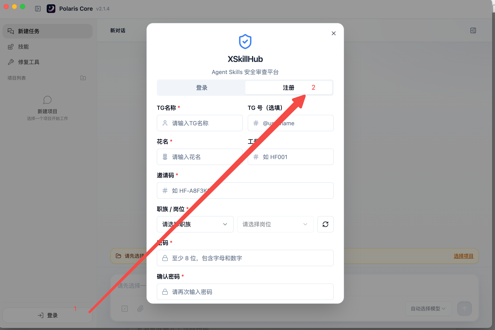

# 一、安装与账号准备

## 1. 下载安装包

请根据你的操作系统下载对应的安装包：

👉 [https://xskillhub.com/](https://xskillhub.com/)

下载完成后按系统默认方式安装即可。

## 2. 账号注册与登录

### 2.1 启动程序

打开 **Polaris Core**。

### 2.2 进入注册

点击左下角的 **「登录」** 按钮，切换到 **「注册」** 界面。

### 2.3 填写信息

按照页面提示填写个人账户信息：

| 字段 | 说明 |
| --- | --- |
| 账号 / 邮箱 | 用于登录和找回密码 |
| 密码 | 建议使用强密码 |
| **邀请码** | 由官方发放的有效邀请码。**若你未持有，请联系你的服务支持人员。** |

### 2.4 登录

注册成功后，回到登录界面输入账号密码即可，开启你的 AI 旅程。

---

> 下一步：[二、核心功能操作指南](core-features.md)
